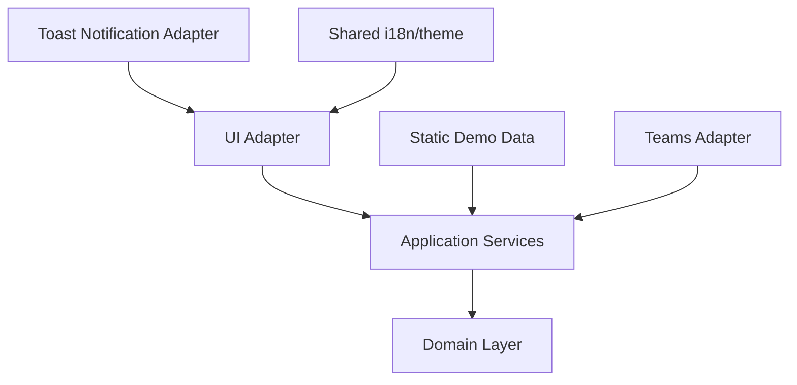
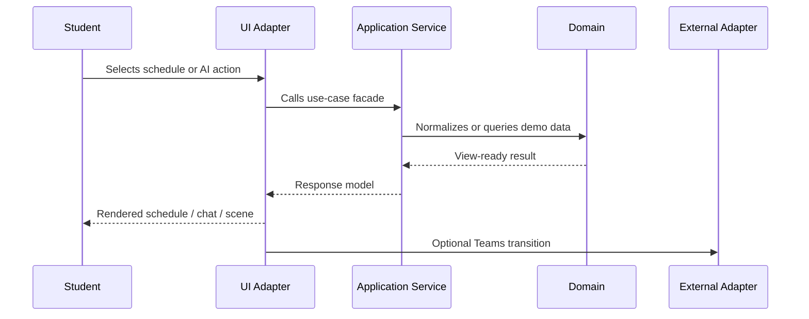

# Architecture Overview

The public demo is organized as a frontend-only prototype using a lightweight Hexagonal Architecture + DDD-inspired structure.

The goal is not to imitate a backend-heavy enterprise system. The goal is to keep the browser prototype understandable, replaceable and ready for future real integrations.

## Analysis Documents

The implementation plan is driven by student-facing scenarios:

- [User Stories](USER_STORIES.md)
- [Use Cases](USE_CASES.md)

These documents define the behavior that later code layers should satisfy.

## Layers

| Layer | Responsibility | Example |
|---|---|---|
| Domain | Core concepts and rules | schedule records, teachers, AI demo catalog |
| Application | Use-case services and facades | schedule service, AI assistant service |
| Adapters | Browser and external boundaries | schedule widget renderer, assistant widget renderer, shell renderer, toast notification renderer, Teams transition adapter |
| Shared | Cross-cutting frontend utilities | i18n resources/translator facade, theme tokens/service facade |
| Data | Static demo data | schedule dataset, AI fixture catalog |

## Dependency Direction

Domain logic should not depend on DOM rendering, browser events or external platform APIs. UI and integration details should point inward to application/domain services.

## App Shell

The GitHub Pages entry point is intentionally thin:

| File | Responsibility |
|---|---|
| `index.html` | Static browser entry point and script composition order |
| `src/main.js` | Application bootstrap and dependency wiring |
| `src/adapters/ui/shell-renderer.js` | Desktop-first shell rendering, tabs and UI events |
| `src/adapters/ui/styles.css` | CSS variables, layout rules and responsive shell behavior |
| `src/adapters/ui/assistant-widget.css` | Assistant-specific widget, chat and visual scene styles |
| `src/adapters/ui/toast-notification-renderer.js` | Small notification adapter for demo actions and future integration feedback |
| `src/adapters/teams/teams-transition-adapter.js` | Frontend-only Teams transition boundary used by schedule actions |

The shell behaves like separate workbook-style screens: the schedule tab and the AI assistant tab are not rendered as two always-visible columns. The active tab controls which screen is visible, while later detail panels can still be opened inside the selected feature.

This keeps the page host separate from feature widgets. The shell receives already-created `scheduleWidget` and `assistantWidget` adapters from `src/main.js` and only coordinates tab, language and theme events.

## Schedule Flow

The schedule feature is split across data, domain, application and UI adapter files:

| File | Responsibility |
|---|---|
| `data/schedule-data.js` | Sanitized static public schedule slice |
| `src/domain/schedule/teachers.js` | Manual teacher registry and aliases |
| `src/domain/schedule/schedule-domain.js` | Normalization, aggregation, labels and filtering rules |
| `src/application/schedule/schedule-service.js` | Filter defaults, filter options, stats and view models |
| `src/adapters/ui/schedule-widget-renderer.js` | Browser rendering and UI event handling for filters, table rows and details |

The renderer does not read raw data directly. It asks the application service for a view model and then renders it.

The schedule screen follows the original prototype composition: one feature screen with a top control area, a dense filter row, a left schedule table/list widget and a right details/Teams widget. This keeps widget types consistent across the UI while still preserving the tab boundary between schedule and AI assistant screens.

The public schedule slice is documented as February-June 2026. It was parsed semi-automatically and should be treated as demo data that may need manual verification.

## AI Assistant Flow

The AI feature is a public demo fixture flow, not a production AI integration:

| File | Responsibility |
|---|---|
| `data/ai-demo-catalog.js` | Prepared questions, answer fixtures, AWS labs and visual scene fixtures |
| `src/application/assistant/assistant-service.js` | Chat state defaults, submit/clear/open-scene use cases and five-question demo limit |
| `src/adapters/ui/assistant-widget-renderer.js` | Browser rendering and UI event handling for prepared questions, cumulative chat and visual scenes |
| `src/adapters/ui/assistant-widget.css` | Assistant-specific responsive layout and component styles |

The assistant tab follows the prototype behavior:

- selecting a prepared question immediately appends the question and fixture answer to chat history;
- the composer is reserved for custom questions and returns an explicit real-AI-not-connected demo response;
- submitting any new question clears the currently active visual scene;
- clicking an assistant answer opens the related visual scene on the right;
- `New chat` clears the history and hides the active scene;
- the public demo is limited to five submitted questions;
- custom questions fall back to a demo feedback scene until a real AI adapter exists.

## Teams Transition Flow

The schedule UI does not call the toast adapter directly. When the user selects `Open Teams`, the schedule widget passes the selected schedule item to `src/adapters/teams/teams-transition-adapter.js`.

In the public demo, the Teams adapter is intentionally frontend-only. It does not open Microsoft Graph or a production Teams deep link. Instead, it uses the toast notification adapter to show a small demo transition message in the bottom-right corner and keeps it visible while the user hovers over it.

Later, the same Teams adapter boundary can be replaced with Microsoft Graph, a Teams deep link, or a browser extension bridge while leaving the schedule UI unchanged.

## UI Feedback Flow

Demo-only actions should still look like real user feedback. The toast notification adapter is a reusable UI feedback mechanism for safe demo transitions, warnings and future integration states.

## Shared Localization

Localization is decomposed into small shared files instead of one large utility file:

| File | Responsibility |
|---|---|
| `src/shared/i18n/resources.js` | Stores supported languages and translation dictionaries |
| `src/shared/i18n/translator.js` | Provides internal language normalization, fallback lookup and translator factory |
| `src/shared/i18n/index.js` | Exposes the public i18n module facade used by application/UI code |

This keeps UI text out of domain code while avoiding a large mixed-purpose helper.

## Shared Theme

Theme handling follows the same small-module rule as localization:

| File | Responsibility |
|---|---|
| `src/shared/theme/tokens.js` | Stores semantic theme names, spacing/radius tokens and day/night palettes |
| `src/shared/theme/theme-service.js` | Normalizes theme names, creates theme state and applies CSS variables to a target element |
| `src/shared/theme/index.js` | Exposes the public theme facade used by UI adapters |

The theme module is shared infrastructure. It does not know about schedule records, AI answers or Teams navigation.

## Why This Shape

The prototype needs to show both working behavior and future growth points:

- schedule logic works now without a backend;
- AI is represented as a demo catalog / fixture flow;
- Teams navigation is isolated behind an adapter;
- future Microsoft Graph, Moodle, on-demand and AI APIs can replace demo adapters.

## Application Flow

The application flow should stay close to use cases:

1. User changes filter or selects an action.
2. UI adapter reads the event and calls an application service.
3. Application service prepares view data from domain/data modules.
4. UI adapter renders the result.
5. External transitions, such as Teams navigation, go through an adapter boundary.

## Current Demo Boundaries

Some parts are intentionally demo/stub implementations:

| Boundary | Current form | Future replacement |
|---|---|---|
| Teams transition | Frontend Teams adapter with toast feedback | Microsoft Graph / Teams API adapter |
| AI responses | Fixture/catalog data with visual scenes | Real AI assistant API adapter |
| Learning resources | Fixture scenes only | Moodle / on-demand resources adapter |
| Storage/cache | Planned only | Browser extension storage/cache adapter |

## Documentation And Diagrams

GitHub renders Mermaid diagrams directly in Markdown, so public documentation should prefer Mermaid for diagrams that need to be visible in the repository.

PlantUML can still be useful as architecture source files. If PlantUML is used, store `.puml` files in `docs/diagrams` and optionally commit generated `.svg` or `.png` files for direct viewing.
