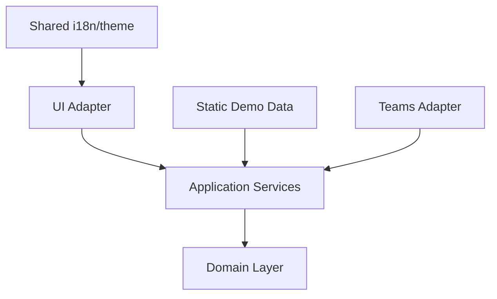
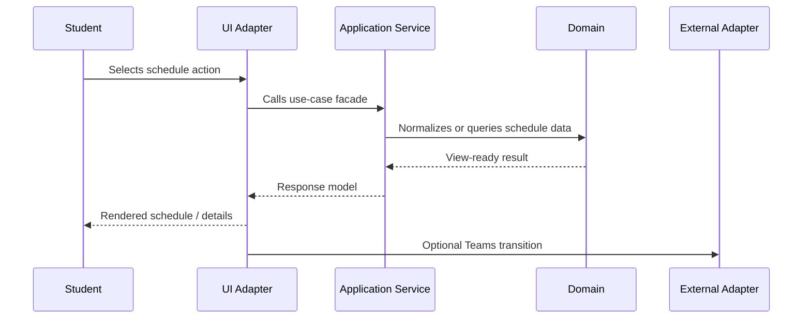

# Architecture Overview

The public demo is organized as a frontend-only prototype using a lightweight Hexagonal Architecture + DDD-inspired structure.

The goal is not to imitate a backend-heavy enterprise system. The goal is to keep the browser prototype understandable, replaceable and ready for future real integrations.

## Layers

| Layer | Responsibility | Example |
|---|---|---|
| Domain | Core concepts and rules | schedule records, teachers, AI demo catalog |
| Application | Use-case services and facades | schedule service, AI assistant service |
| Adapters | Browser and external boundaries | DOM renderer, Teams transition adapter |
| Shared | Cross-cutting frontend utilities | i18n resources |
| Data | Static demo data | schedule dataset |

## Dependency Direction

Domain logic should not depend on DOM rendering, browser events or external platform APIs. UI and integration details should point inward to application/domain services.

## Why This Shape

The prototype needs to show both working behavior and future growth points:

- schedule logic works now without a backend;
- AI is represented as a demo catalog / fixture flow;
- Teams navigation is isolated behind an adapter;
- future Microsoft Graph, Moodle, on-demand and AI APIs can replace demo adapters.

## Application Flow

The application flow should stay close to use cases:

1. User changes filter or selects an action.
2. UI adapter reads the event and calls an application service.
3. Application service prepares view data from domain/data modules.
4. UI adapter renders the result.
5. External transitions, such as Teams navigation, go through an adapter boundary.

## Current Demo Boundaries

Some parts are intentionally demo/stub implementations:

| Boundary | Current form | Future replacement |
|---|---|---|
| Teams transition | Frontend demo adapter | Microsoft Graph / Teams API adapter |
| AI responses | Fixture/catalog data | Real AI assistant API adapter |
| Learning resources | Planned only | Moodle / on-demand resources adapter |
| Storage/cache | Planned only | Browser extension storage/cache adapter |

## Documentation And Diagrams

GitHub renders Mermaid diagrams directly in Markdown, so public documentation should prefer Mermaid for diagrams that need to be visible in the repository.

PlantUML can still be useful as architecture source files. If PlantUML is used, store `.puml` files in `docs/diagrams` and optionally commit generated `.svg` or `.png` files for direct viewing.
