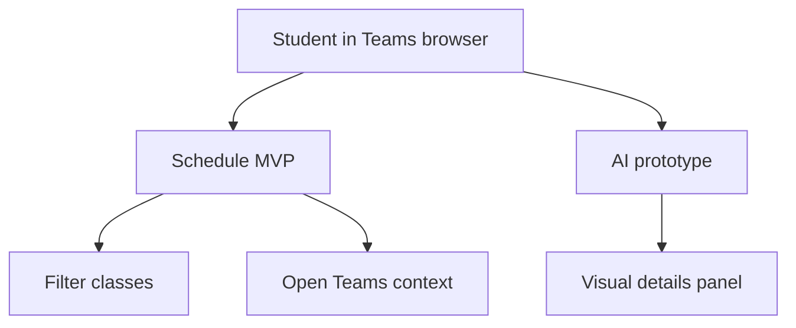

# User Stories

The public demo is focused on a student who already uses Microsoft Teams and needs a faster way to understand schedule context, related Teams navigation and future AI assistance.

## Primary Persona

**Student**

A WWSI student who uses Microsoft Teams in the browser and wants a compact assistant layer for class schedule, materials and future task tracking.

## Product Assumptions

- The user is already authenticated in Microsoft Teams by Microsoft.
- The prototype is desktop-first because the target experience is a browser plugin / overlay.
- The schedule module is the working MVP.
- The AI module is a visible prototype simulation in the public demo.
- Future production integrations can use Teams, Moodle, on-demand resources and AI APIs through adapters.

## Stories

### US-01: Check Current Class

As a student, I want to quickly see what class is current or next, so that I know what I should attend or prepare for.

Acceptance notes:

- The schedule can be loaded from a dedicated data module.
- The application can calculate display-ready schedule entries.
- The UI can highlight useful schedule context.

### US-02: Filter Schedule

As a student, I want to filter the schedule by group, subject, type or teacher, so that I can find relevant classes without manually scanning a long list.

Acceptance notes:

- Filters are UI actions.
- Filtering is handled through application/domain logic, not ad hoc DOM filtering.
- UI labels are localized.

### US-03: Move From Schedule To Teams Context

As a student, I want to use a schedule entry as a starting point for opening the related Teams context, so that I do not have to search Teams manually.

Acceptance notes:

- The public demo keeps this behavior safe and frontend-only.
- Teams transition is isolated behind an adapter.
- Private experimental addressing syntax is not exposed in the public repository.

### US-04: Ask The Assistant For Study Context

As a student, I want to ask the assistant prepared study-related questions, so that I can understand how a future AI workflow could help me with classes and materials.

Acceptance notes:

- Public demo responses can be fixture/catalog based.
- The demo must clearly communicate that AI is simulated in this version.
- The chat should accumulate question and answer history.

### US-05: Open Visual Details From AI Answer

As a student, I want to open more details from an AI answer, so that I can see a visual interpretation of the assistant response.

Acceptance notes:

- Clicking an answer or details action opens a related right-side visual panel.
- On smaller screens, the UI can scroll to the visual response panel.
- Starting a new chat clears chat history and closes the current visual panel.

## Story Map

## Traceability

| Story | Planned implementation area |
|---|---|
| US-01 | schedule dataset, domain normalization, schedule service, UI renderer |
| US-02 | i18n, schedule service, UI controls, DOM renderer |
| US-03 | Teams transition adapter |
| US-04 | AI demo catalog, AI assistant service |
| US-05 | AI chat UI, visual response renderer, responsive behavior |
