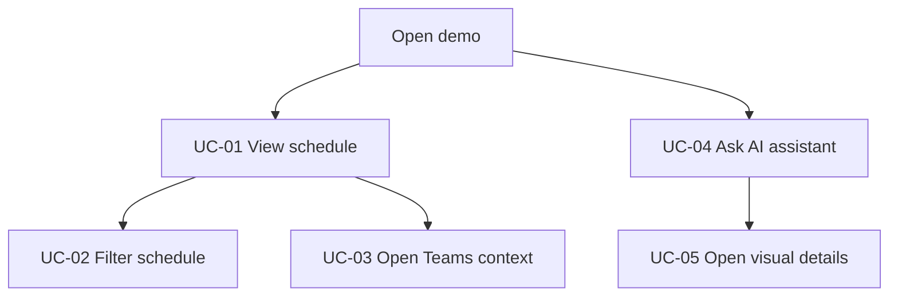
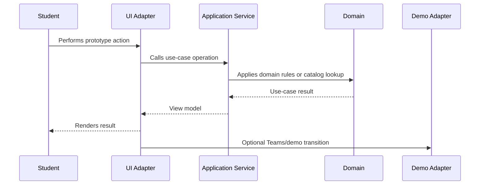

# Use Cases

This document connects the student-facing stories with implementation boundaries planned for the frontend prototype.

## Actors

| Actor | Description |
|---|---|
| Student | Main user of the browser plugin / overlay prototype |
| Teams Browser Session | Existing Microsoft Teams browser context where the user is already signed in |
| Demo AI Assistant | Fixture/catalog-based assistant simulation in the public demo |

## UC-01: View Schedule

**Goal:** show the student a useful schedule view.

**Primary actor:** Student

**Preconditions:**

- Schedule dataset is available in the static demo.
- Application has a schedule service that can prepare view data.

**Main flow:**

1. Student opens the demo page.
2. UI adapter initializes the application.
3. Application service reads schedule data.
4. Domain helpers normalize and group raw records.
5. UI adapter renders schedule entries.

**Result:**

Student sees display-ready schedule data.

**Implementation mapping:**

- `data/schedule-data.js`
- `src/domain/schedule/*`
- `src/application/schedule/schedule-service.js`
- `src/adapters/ui/dom-renderer.js`

## UC-02: Filter Schedule

**Goal:** reduce the schedule view to relevant entries.

**Primary actor:** Student

**Preconditions:**

- Schedule view is loaded.
- Filter controls are available.

**Main flow:**

1. Student changes a filter.
2. UI adapter sends filter criteria to the application service.
3. Application service requests filtered/normalized data.
4. Domain helpers apply schedule rules.
5. UI adapter renders the filtered result.

**Result:**

Student sees only schedule entries matching the selected criteria.

**Implementation mapping:**

- `src/application/schedule/schedule-service.js`
- `src/domain/schedule/schedule-domain.js`
- `src/shared/i18n.js`
- `src/adapters/ui/dom-renderer.js`

## UC-03: Open Teams Context From Schedule

**Goal:** let the schedule entry act as a bridge toward Teams context.

**Primary actor:** Student

**Supporting actor:** Teams Browser Session

**Preconditions:**

- Student is already signed in to Teams in the browser.
- Schedule entry contains enough demo context to show a transition action.

**Main flow:**

1. Student selects a Teams-related action from a schedule entry.
2. UI adapter calls the transition use case.
3. Application delegates external navigation to the Teams adapter.
4. Teams adapter performs the current public demo behavior.

**Result:**

Student sees a demo-safe transition behavior and the code remains ready for future real Teams integration.

**Implementation mapping:**

- `src/adapters/teams/teams-transition-adapter.js`
- `src/application/schedule/schedule-service.js`
- `src/adapters/ui/dom-renderer.js`

## UC-04: Ask AI Demo Assistant

**Goal:** demonstrate the intended AI interaction model.

**Primary actor:** Student

**Supporting actor:** Demo AI Assistant

**Preconditions:**

- AI tab is available.
- Demo catalog contains prepared answers.

**Main flow:**

1. Student selects a prepared question or enters supported demo text.
2. UI adapter sends the question to the AI application service.
3. AI service resolves a fixture/catalog response.
4. UI adapter appends question and answer to the chat history.
5. Answer includes a details action when a visual response is available.

**Result:**

Student sees a simulated AI answer and can continue the demo conversation.

**Implementation mapping:**

- `src/domain/ai-demo/ai-demo-catalog.js`
- `src/application/ai/ai-assistant-service.js`
- `src/adapters/ui/dom-renderer.js`

## UC-05: Open AI Visual Details

**Goal:** show a visual interpretation of the selected assistant answer.

**Primary actor:** Student

**Preconditions:**

- Chat contains an AI response with a visual detail target.

**Main flow:**

1. Student clicks the answer or details action.
2. UI adapter reads the response target.
3. UI adapter renders the related visual panel.
4. On smaller screens, UI scrolls toward the visual panel.

**Result:**

Student sees the visual response/details panel connected to the assistant answer.

**Implementation mapping:**

- `src/application/ai/ai-assistant-service.js`
- `src/adapters/ui/dom-renderer.js`
- responsive layout styles

## Use Case Flow Diagram

## Boundary Sequence

